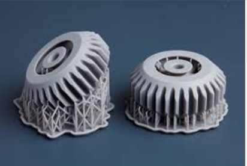

# 🧩 Spare3D — Engineering Internship (Paris)

## 🧠 Overview
This repository summarizes my **engineering internship at Spare3D (Paris)**, a company specialized in additive manufacturing and digital part management solutions.  
My work focused on **automation, optimization, and algorithm development** within the **Digipart platform**, with the goal of improving the efficiency and reliability of 3D printing workflows.  

The internship combined both **software engineering** and **mechanical design**, bridging the gap between  optimization and practical additive manufacturing.

  

---

## ⚙️ Technical Details

| Category | Details |
|-----------|----------|
| **Languages** | Python |
| **Frameworks / Libraries** | `NumPy`, `pandas`, `scikit-learn`, `matplotlib`, internal APIs |
| **Techniques** | Optimization algorithms, process automation, geometry analysis |
| **Tools** | Digipart software, CAD (SolidWorks / Fusion 360) |
| **Environment** | Ubuntu / Windows, VS Code |
| **Soft Skills** | Self-directed, analytical problem-solving, technical documentation, process standardization |

---

## 🎯 Main Missions

- 🧮 **Implementation of optimization and automation modules** within the Digipart software to streamline digital part management and printing operations.  
- 📘 **Development of operational process documentation** and **user guidelines** to ensure reproducibility and scalability of workflows.  
- 🤖 **Design of a Python-based algorithm** for identifying **internal, external, and accessible supports** on 3D-printed parts, improving manufacturability and print quality.  

---

## 💡 Key Learnings & Impact

- Improved automation in the Digipart workflow, reducing manual intervention in part preparation.  
- Gained hands-on experience in **optimization logic**, **3D geometry analysis**, and **CAD integration**.  
- Strengthened ability to work autonomously on complex algorithmic and mechanical design challenges.  

---

## 🧠 Relevant Skills

| Domain | Skills |
|--------|---------|
| **Programming** | Python, Optimization Algorithms, Data Processing |
| **Engineering** | CAD Modeling, Additive Manufacturing, Reverse Engineering |
| **Soft Skills** | Analytical Thinking, Process Documentation, Initiative and Autonomy |

---
